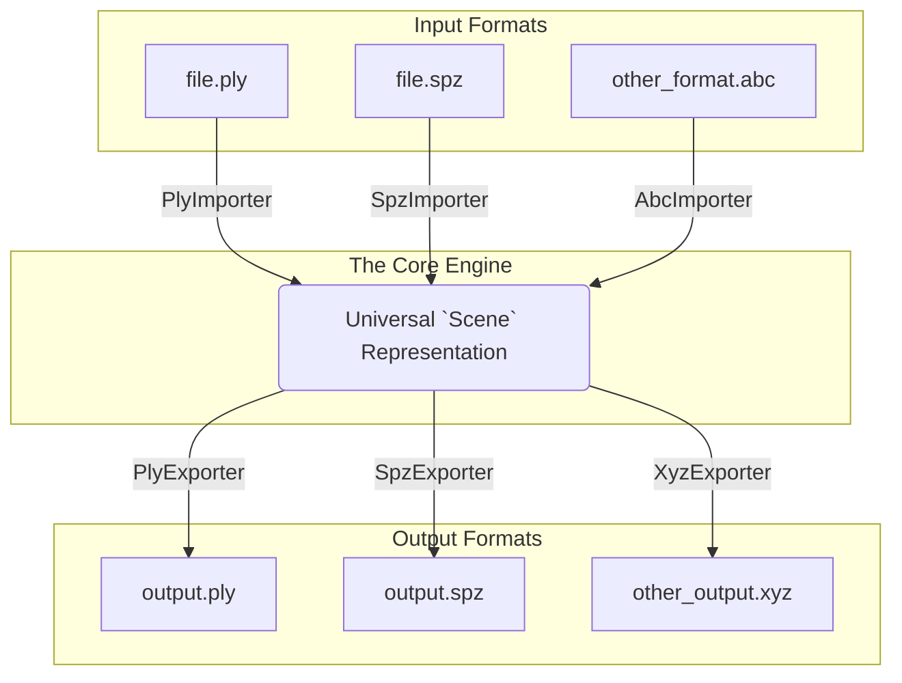

# Gaussian splatting converter
This is a library to perform gaussian splatting conversions, written in Rust for maximum performance and safety, it serves as the core conversion engine for the [Splattr](https://splattr.app) ecosystem.

## How It Works

This library is designed around a powerful and scalable **hourglass architecture**. Instead of writing direct, one-to-one converters for every possible format pair (e.g., PLY-to-SPZ, SPZ-to-PLY, etc.), all conversions pass through a common, in-memory representation of the scene.

This intermediate representation acts as a "universal language" for Gaussian splats. The entire process can be visualized as a funnel in and a funnel out, with a single, standardized format in the middle.



### The Three Core Components

1. **Importers (The Top Funnel)**
  Each supported input format (like `.ply` or `.spz`) has its own dedicated **Importer**. An importer's only job is to read a specific file format from a byte stream and translate its contents into the library's universal `Scene` struct. It acts as a specialized parser, decoding the source format into our common language.

2. **The `Scene` Struct (The Narrow Waist of the Hourglass)**
  The `Scene` struct contains a vector of `GaussianSplat` structs, is the single, standardized, in-memory representation of the data. All data flows through this central format.
  ```rust
  // A single Gaussian Splat
  pub struct GaussianSplat {
    pub position: [f32; 3],
    pub normal: [f32; 3],
    pub spherical_harmonics_dc: [f32; 3],
    pub spherical_harmonics_rest: Vec<f32>,
    pub opacity: f32,
    pub scale: [f32; 3],
    pub rotation: [f32; 4], // Quaternion (w, x, y, z)
  }

  // A Scene is just a vector of gaussian splats
  pub struct Scene {
    pub splats: Vec<GaussianSplat>,
  }
  ```

3. **Exporters (The Bottom Funnel)**
  An **Exporter** does the reverse of an importer. It takes the universal `Scene` struct and serializes it into the byte stream of a specific output file format. For example, the `PlyBinaryExporter` knows how to take the data from the `Scene` and write it out according to the binary PLY specification.

## Supported Formats

The underlying conversion logic is powered by the `converter_core` library.

| Format | Extension | Read Support | Write Support | Notes |
| :--- | :---: | :---: | :---: | :--- |
| **PLY** | `.ply` | ✅ | ✅ | Supports `binary` (default) and `ascii` encoding on write. |
| **SPLAT** | `.splat` | ✅ | ✅ | Standard format used by many viewers. |
| **SPZ** | `.spz` | ✅ | ✅ | A compressed format using ZIP. Writes as v2. |
| **CSV** | `.csv` | ✅ | ✅ | Useful for debugging or data analysis. |
